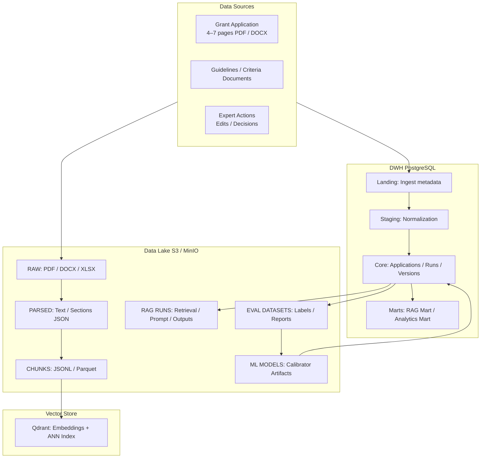
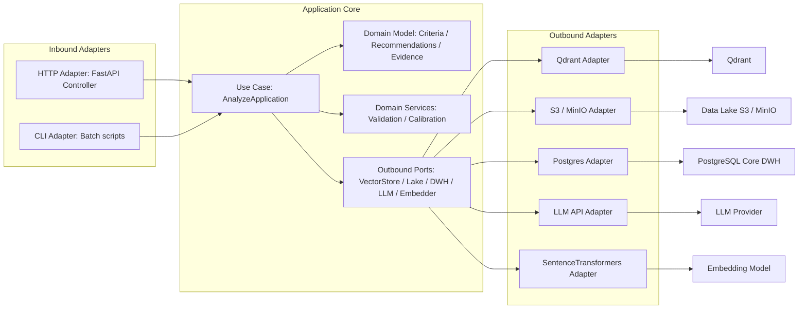

## Схема обработки и хранения данных по слоям и типам хранилищ(Data Lake + DWH + Vector DB)

```mermaid
flowchart TB
subgraph SRC["Data Sources"]
  A1["Grant Application\n4–7 pages PDF / DOCX"]
  A2["Guidelines / Criteria Documents"]
  A3["Expert Actions\nEdits / Decisions"]
end

subgraph LAKE["Data Lake S3 / MinIO"]
  L0["RAW: PDF / DOCX / XLSX"]
  L1["PARSED: Text / Sections JSON"]
  L2["CHUNKS: JSONL / Parquet"]
  L3["RAG RUNS: Retrieval / Prompt / Outputs"]
  L4["ML MODELS: Calibrator Artifacts"]
  L5["EVAL DATASETS: Labels / Reports"]
end

subgraph DWH["DWH PostgreSQL"]
  D0["Landing: Ingest metadata"]
  D1["Staging: Normalization"]
  D2["Core: Applications / Runs / Versions"]
  D3["Marts: RAG Mart / Analytics Mart"]
end

subgraph VDB["Vector Store"]
  V1["Qdrant: Embeddings + ANN Index"]
end

SRC --> L0
SRC --> D0

L0 --> L1
L1 --> L2
L2 --> V1

D0 --> D1 --> D2 --> D3
D2 --> L3
D2 --> L5
L5 --> L4
L4 --> D2
```

## Гексагональная схема (Ports & Adapters)

```mermaid
flowchart LR
subgraph IN["Inbound Adapters"]
  HTTP["HTTP Adapter: FastAPI Controller"]
  CLI["CLI Adapter: Batch scripts"]
end

subgraph CORE["Application Core"]
  UC["Use Case: AnalyzeApplication"]
  DOM["Domain Model: Criteria / Recommendations / Evidence"]
  SVC["Domain Services: Validation / Calibration"]
  PORTS["Outbound Ports: VectorStore / Lake / DWH / LLM / Embedder"]
end

subgraph OUT["Outbound Adapters"]
  AVDB["Qdrant Adapter"]
  ALAKE["S3 / MinIO Adapter"]
  ADWH["Postgres Adapter"]
  ALLM["LLM API Adapter"]
  AEMB["SentenceTransformers Adapter"]
end

HTTP --> UC
CLI --> UC

UC --> DOM
UC --> SVC
UC --> PORTS

PORTS --> AVDB --> VDB["Qdrant"]
PORTS --> ALAKE --> LAKE["Data Lake S3 / MinIO"]
PORTS --> ADWH --> PG["PostgreSQL Core DWH"]
PORTS --> ALLM --> LLM["LLM Provider"]
PORTS --> AEMB --> EMB["Embedding Model"]
```
