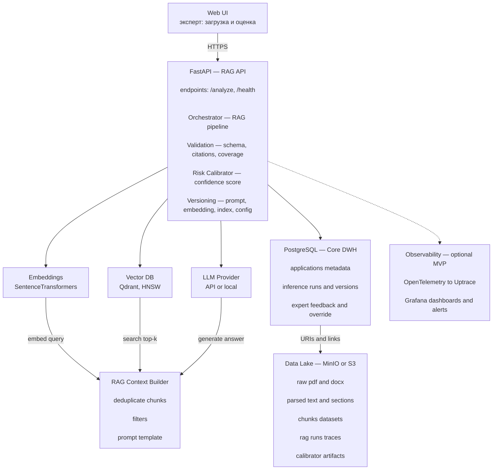

# Product Requirements Document (PRD)

## RAG-система поддержки экспертизы и доработки благотворительных заявок

---

## 1. Problem & Motivation

Экспертиза заявок на благотворительные и грантовые программы выполняется вручную и занимает **60–120 минут на заявку**.  
Процесс требует одновременного учёта методических критериев, накопленного экспертного опыта и качества аргументации заявителя.  
Это приводит к высокой когнитивной нагрузке экспертов и вариативности качества экспертных выводов и рекомендаций.

---

## 2. Product Vision & Purpose

> **Ключевой принцип**  
> Система поддерживает эксперта, но **никогда не заменяет финальное решение человека**.

Продукт предназначен для **ускорения и стандартизации экспертной оценки заявок**, а также для **формирования рекомендаций по доработке заявки**.  
Автоматизация принятия решений намеренно исключена.

---

## 3. Object of Analysis

| Параметр | Значение |
|---------|----------|
| Тип данных | Текстовая заявка |
| Объём | **4–7 страниц** |
| Размер | **3 000–8 000 слов** |
| Состав | Проект · Бюджет · Команда · Эффект |
| Вложения | Таблицы, бюджеты (дополнительный контекст) |

---

## 4. Target Users

- **Эксперты фонда** (1–20 пользователей)
- **Методологи и аналитики программ** (2–5 пользователей)
- **Администраторы системы** (1–2 пользователя)

---

## 5. Product Goals (Business)

| Метрика | Целевое значение |
|-------|-----------------|
| Сокращение time-to-review | **≥ 30%** |
| Доля заявок с рекомендациями | **≥ 80%** |
| Override rate экспертов | **≤ 40%** |

---

## 6. Key Use Cases

1. Анализ заявки и формирование экспертного отчёта  
2. Проверка соответствия критериям программы  
3. Генерация рекомендаций по доработке заявки  
4. Объяснение выводов с указанием источников  
5. Сбор и анализ экспертной обратной связи  

---

## 7. Functional Scope

### Основные функции
- RAG-поиск по:
  - корпусу заявок,
  - методическим материалам,
  - критериям программ
- Генерация:
  - оценок соответствия критериям,
  - рекомендаций по улучшению заявки

### Обязательные ограничения
- Все утверждения сопровождаются **цитированием источников (`chunk_id`)**
- При нехватке данных система возвращает режим  
  **`insufficient evidence`**

---

## 8. LLM Usage Policy

### Разрешено
- Использование **предобученных LLM**
- Режим **inference-only**

### Поддерживаемые модели
- GPT-4 / GPT-4o  
- LLaMA-3 / Qwen  
- GigaChat (при работе в закрытом контуре)

### Явно запрещено
- Fine-tuning LLM
- Автоматическое принятие решений

---

## 9. System Architecture (RAG)
Краткая схема

Подробная схема

## 10. Trust / Risk Calibrator

> **Научно значимый компонент системы**  
> Единственный обучаемый ML-модуль.

### Назначение
Оценка вероятности того, что эксперт **примет результат ИИ без существенных правок**.

### Используемые признаки
- similarity retrieval  
- coverage контекста  
- корректность цитирования  
- длина и структура ответа  

### Выход
- `confidence_score ∈ [0,1]`

Калибратор используется для фильтрации рискованных ответов и поддержки решения о доверии к результату ИИ.

---

## 11. Data & Storage Model

| Уровень | Технология | Содержимое |
|--------|------------|------------|
| Data Lake | S3 / MinIO | PDF, тексты, чанки, RAG-трейсы |
| Core DWH | PostgreSQL | заявки, версии компонентов, inference-runs, экспертные правки |
| Vector DB | Qdrant | embeddings |

**MVP-объём:** ~500 заявок · 50k–100k чанков

---

## 12. Quality Metrics (ML / RAG)

| Метрика | Target |
|--------|--------|
| Precision@k | ≥ **0.6** |
| nDCG@k | ≥ **0.7** |
| Coverage | ≥ **80%** |
| Citation validity | ≥ **99%** |
| Insufficient evidence rate | **10–25%** |

---

## 13. North Star Metric

**Среднее время экспертизы заявки (minutes per application)**

### Guardrails
- override rate ≤ 40%  
- coverage ≥ 80%  
- citation validity ≥ 99%  

---

## 14. Monitoring & Observability

- Online-метрики inference (coverage, similarity, latency)
- Distributed tracing (OpenTelemetry)
- p95 latency и error rates (Grafana / Uptrace)

---

## 15. Deployment & Reproducibility

### MVP
- Docker Compose (API, PostgreSQL, Qdrant, MinIO)

### Pilot
- Cloud VM  
- Managed storage  

> GPU — опционально (embeddings, re-ranking, local LLM)

---

## 16. Risks & Mitigation

| Риск | Митигирование |
|-----|--------------|
| Data drift | Proxy-метрики + PSI |
| Галлюцинации | Строгая валидация цитирования |
| Новые типы заявок | Degradation mode + обновление RAG-корпуса |

---

## 17. MVP Success Criteria

- ≥ 100 заявок обработано  
- Time-to-review ↓ ≥ 30%  
- Рекомендации выданы ≥ 80% кейсов  
- Эксперты используют систему ≥ 70% заявок  

---

## 18. One-Sentence Product Thesis

> RAG-система, анализирующая заявки на гранты объёмом 4–7 страниц, формирующая экспертные выводы и рекомендации по доработке заявки и оценивающая надёжность собственных результатов с помощью обучаемого калибратора доверия.
